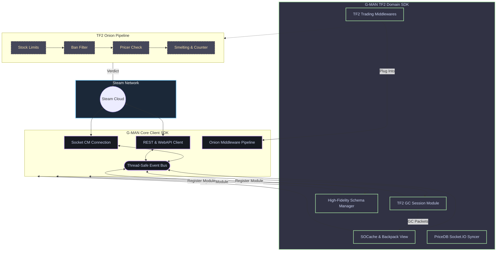

<div align="center">

# 🎒 G-MAN TF2

### Экономический движок и доменный модуль Team Fortress 2 для G-MAN

[](https://pkg.go.dev/github.com/lemon4ksan/g-man-tf2)
[](https://goreportcard.com/report/github.com/lemon4ksan/g-man-tf2)
[](LICENSE)
[](https://github.com/lemon4ksan/g-man-tf2/stargazers)

> _"Нужный бот в нужном месте может перевернуть весь рынок металла."_

#### 🇺🇸 [English](README.md) • 🇷🇺 [Русский](README_RU.md)

</div>

---

**G-MAN TF2** — это официальный высокопроизводительный доменный модуль Team Fortress 2 промышленного уровня, разработанный специально для автоматизационного фреймворка [G-MAN](https://github.com/lemon4ksan/g-man). Он объединяет интеграцию с Игровым Координатором Valve (GC), real-time кэширование инвентаря SOCache и сложные алгоритмы арифметики валюты TF2 в единый потокобезопасный Go-пакет.

Благодаря выделению всей TF2-специфичной логики из монолитного ядра в отдельный внешний модуль, **G-MAN TF2** функционирует как независимый плагин. Он бесшовно интегрируется с сетевым транспортом G-MAN, распределенной шиной событий (Event Bus) и конвейером проверок Onion-middlewares.

```shell
go get github.com/lemon4ksan/g-man-tf2@latest
```

---

## 🛠 Архитектура и интеграция

**G-MAN TF2** подключается к ядру клиента G-MAN в виде набора независимых модулей, регистрируемых через стандартные опции инициализации. Модуль слушает бинарные сетевые пакеты сокетов и публикует строго типизированные события в общую шину данных:



---

## ⚡ Разбор ключевых возможностей

### 🪙 1. Безопасная арифметика валюты (`tf2/currency`)
Торговля предметами в TF2 требует ювелирных расчетов в **Ключах** и **Металле (Scrap, Reclaimed, Refined)**. Стандартная математика с плавающей запятой `float64` накапливает погрешности (например, `0.11 + 0.22 = 0.33000000000000007`), что фатально для автоматических ботов.
* G-MAN TF2 решает эту проблему за счет полного перевода дробных долей металла в целочисленный базовый лом (`Scrap`).
* Сложение `AddRefined(1.55, 0.55)` гарантированно дает точный результат `2.11` очищенного металла. Библиотека безопасно конвертирует металлы в ключи и обратно на основе живого курса.

### 🎒 2. Синхронизация с Игровым Координатором через `SOCache` (`tf2/backpack`)
Обычные боты постоянно запрашивают инвентарь через веб-интерфейс Steam API (HTTP), что сопряжено с жесткими лимитами запросов (rate limits) и задержками. G-MAN TF2 поддерживает синхронный **SOCache (Shared Object Cache)** непосредственно в памяти игрового координатора Valve:
* При крафте, обмене или удалении предмета Valve присылает бинарное дельта-обновление по сокету.
* G-MAN TF2 мгновенно (за O(1)) применяет патч к локальному кэшу памяти и генерирует событие `BackpackLoadedEvent`, обеспечивая нулевую задержку доступа к реальному инвентарю бота.

### 📈 3. Локальный кэш цен PriceDB и автопрайсинг (`tf2/bptf` & `tf2/pricedb`)
Оценка стоимости предметов происходит без лишних HTTP-запросов.
* Пакет `bptf` подключается по протоколу WebSockets (`Socket.IO`) напрямую к потоку обновлений цен от `backpack.tf`.
* Менеджер `pricedb` применяет новые рейты в фоне, делая их мгновенно доступными для конвейера валидации Onion-middlewares.

### ⚒️ 4. Автоматический крафт и размен металла (`tf2/crafting`)
Необходима точная сдача или распределение слотов во время сделки?
* Движок плавки автоматически конструирует рецепты, объединяет и разъединяет металл (`Scrap` $\leftrightarrow$ `Reclaimed` $\leftrightarrow$ `Refined`), а также переплавляет дубликаты оружия для точной выдачи сдачи партнеру.

---

## 📂 Структура директорий проекта

```text
pkg/
├── tf2/              # Драйвер сессии GC и хранилище SOCache
│   ├── tf2.go        # Инициализация модуля и опции (RegisterModule)
│   ├── socache.go    # Парсер Shared Object GC и кэш инвентаря
│   └── actions.go    # Низкоуровневые команды (крафт, открытие достижений)
├── backpack/         # Управление инвентарем и блокировками предметов при обменах
├── schema/           # Менеджер игровых схем предметов и парсер items_game.txt
├── sku/              # Генераторы и парсеры SKU предметов (качество, эффект, краска)
├── currency/         # Безопасная целочисленная арифметика металлов и ключей
├── pricedb/          # Хранилище локальных цен и адаптер WebSockets (Socket.IO)
├── bptf/             # Интеграция с backpack.tf (управление листингами, скрейпинг)
├── behavior/         # Высокоуровневые циклы поведения (авто-ключи, лимиты склада)
├── trading/          # Многослойные цепочки проверок трейдов (Onion Middlewares)
├── crit/             # Синхронизация витрины листингов Crit.tf и backpack.tf
├── ecp/              # Escrow Bypass Chat Protocol (форматирование и сжатие имен)
├── rep/              # Утилиты проверки репутации и отзывов пользователей
├── reason/           # Специфичные для TF2 причины отклонения сделок
└── storage/          # Локальные файловые кэш-адаптеры JSON
```

---

## 🚀 Быстрый старт

### 1. Установка пакетов
Вам понадобятся базовый фреймворк G-MAN и специализированный модуль TF2:

```shell
go get github.com/lemon4ksan/g-man@latest
go get github.com/lemon4ksan/g-man-tf2@latest
```

### 2. Инициализация клиента
Запустите Steam-клиент, зарегистрируйте модули схемы, инвентаря и GC:

```go
package main

import (
	"context"
	"os"

	"github.com/lemon4ksan/g-man/pkg/log"
	"github.com/lemon4ksan/g-man/pkg/steam"
	"github.com/lemon4ksan/g-man/pkg/steam/auth"
	"github.com/lemon4ksan/g-man/pkg/steam/sys/directory"
	"github.com/lemon4ksan/g-man/pkg/storage/jsonfile"
	
	// Импорты модулей G-MAN TF2
	"github.com/lemon4ksan/g-man-tf2/pkg/backpack"
	"github.com/lemon4ksan/g-man-tf2/pkg/schema"
	"github.com/lemon4ksan/g-man-tf2/pkg/tf2"
)

func main() {
	ctx := context.Background()
	store, _ := jsonfile.New("storage.json")
	logger := log.New(log.DefaultConfig(log.LevelInfo))

	// 1. Инициализация клиента Steam с регистрацией TF2-плагинов
	client, err := steam.NewClient(steam.Config{Storage: store},
		steam.WithLogger(logger),
		schema.WithModule(schema.DefaultConfig()), // Регистрация tf2_schema
		tf2.WithModule(),                          // Регистрация tf2
		backpack.WithModule(),                     // Регистрация tf2_backpack
	)
	if err != nil {
		panic(err)
	}
	defer client.Close()

	// 2. Получение ссылок на инициализированные модули
	tf2Mod := tf2.From(client)
	bpMod := backpack.From(client)

	// 3. Подписка на реалтайм-обновления инвентаря из SOCache
	sub := client.Bus().Subscribe(&tf2.BackpackLoadedEvent{})
	go func() {
		for event := range sub.C() {
			if bpEvent, ok := event.(*tf2.BackpackLoadedEvent); ok {
				logger.Info("Инвентарь TF2 успешно синхронизирован через SOCache!", 
					log.Int("items_count", bpEvent.Count),
				)
				
				pure := bpMod.GetPureStock()
				logger.Info("Доступный баланс металлов и ключей",
					log.Int("keys", pure.Keys),
					log.Float64("refined", pure.TotalRefined()),
				)
			}
		}
	}()

	// 4. Поиск оптимального сервера подключения и логин
	dir := directory.New(client.Service())
	server, _ := dir.GetOptimalCMServer(ctx)
	login := auth.NewLogOnDetails(os.Getenv("STEAM_USER"), os.Getenv("STEAM_PASS"))

	if err := client.Run(); err != nil {
		panic(err)
	}

	if err := client.ConnectAndLogin(ctx, server, login); err != nil {
		panic(err)
	}

	client.Wait()
}
```

### 3. Подключение цепочки проверок Onion-Middlewares
Вы можете гибко настраивать бизнес-логику проверки входящих обменов с помощью подключаемого ПО:

```go
package main

import (
	"github.com/lemon4ksan/g-man/pkg/log"
	"github.com/lemon4ksan/g-man/pkg/trading/engine"
	
	"github.com/lemon4ksan/g-man-tf2/pkg/backpack"
	"github.com/lemon4ksan/g-man-tf2/pkg/pricedb"
	"github.com/lemon4ksan/g-man-tf2/pkg/trading"
)

func RegisterPipeline(
	tradeEngine *engine.Engine,
	bp *backpack.Backpack,
	priceMgr *pricedb.Manager,
	logger log.Logger,
) {
	stockCfg := trading.StockConfig{
		MaxTotal:   3000,
		DefaultMax: 20,
		MaxPerSKU: map[string]int{
			"5021;6": 500, // Лимит на Ключи Манн Ко — не более 500 штук
		},
	}

	tradeEngine.Use(
		// 1. Проверка лимитов вместимости склада бота
		trading.StockLimitMiddleware(bp, stockCfg, logger),
		
		// 2. Валидация цен предметов через локальную базу данных
		trading.PricerMiddleware(priceMgr, logger),
	)
}
```

---

## ⚡ Оптимизация памяти и производительности

G-MAN TF2 унаследовал фокус на минимизацию системных требований, что позволяет запускать десятки ботов на одном бюджетном VPS:
* **Fidelity Schema Engine:** Отсекает избыточные структуры данных игрового трекера (особенно в режиме `LiteMode`), кэшируя defindex предметов и схему в пределах **~10 МБ** оперативной памяти.
* **Хранилище SOCache:** Использует высокоэффективные указатели без аллокаций памяти, удерживая общий физический профиль RSS в пределах **~25 МБ** в боевых условиях.

---

## 🤝 Участие в разработке

Мы рады новым участникам в сообществе G-MAN TF2! Если у вас есть предложения по улучшению формул крафта, оптимизации десериализатора схем или расширению интеграции с внешними API:

1. Ознакомьтесь с [CONTRIBUTING.md](CONTRIBUTING.md).
2. Покрывайте изменения тестами: `go test -race ./...`.
3. Создавайте Pull Request с подробным описанием предлагаемой архитектуры.

---

## ⚖️ Лицензия и правовая информация

**Дисклеймер:** Данное программное обеспечение **не** связано, не поддерживается и не одобрено **Valve Corporation** или ее дочерними компаниями. Steam, Team Fortress 2 и все соответствующие товарные знаки принадлежат Valve Corporation. Использование библиотеки происходит на ваш собственный страх и риск.

Проект распространяется под лицензией **BSD 3-Clause License**. Полный текст лицензии доступен в файле [LICENSE](LICENSE).

---

<div align="center">
  <sub>Будьте готовы к непредвиденным последствиям... или просто к следующей распродаже Steam.</sub>
</div>
