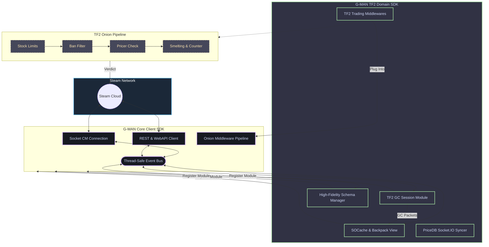

<div align="center">

# 🎒 G-MAN TF2

### The Ultimate Team Fortress 2 Domain Module & Economy Engine for G-MAN

[](https://pkg.go.dev/github.com/lemon4ksan/g-man-tf2)
[](https://goreportcard.com/report/github.com/lemon4ksan/g-man-tf2)
[](LICENSE)
[](https://github.com/lemon4ksan/g-man-tf2/stargazers)

> _"The right bot in the wrong place can make all the difference in the metal market."_

#### 🇺🇸 [English](README.md) • 🇷🇺 [Русский](README_RU.md)

</div>

---

**G-MAN TF2** is the official, production-grade Team Fortress 2 domain module and economy engine designed for the [G-MAN](https://github.com/lemon4ksan/g-man) automation framework. It bridges Valve's Game Coordinator (GC), real-time inventory caching, and complex TF2 trading math into a high-performance, decoupled Go package.

By extracting all TF2-specific structures from the monolithic core framework, **G-MAN TF2** acts as a plug-in package that seamlessly integrates with G-MAN’s dual-stack transport client, thread-safe Event Bus, and Onion trading pipeline.

```shell
go get github.com/lemon4ksan/g-man-tf2@latest
```

---

## 🛠 Integration & Architecture

**G-MAN TF2** integrates with the core G-MAN client as a set of decoupled modules registered via standard options during startup. It consumes general socket protocols and publishes granular events to the shared Event Bus:



---

## ⚡ Key Features Deep Dive

### 🪙 1. Floating-Point Safe Currency Math (`tf2/currency`)
Trading TF2 items demands zero-tolerance precision in **Keys** and **Refined Metal (Scrap, Reclaimed, Refined)**. Standard `float64` floating-point math introduces rounding errors (e.g., `0.11 + 0.22 = 0.33000000000000007`), which will instantly trigger trade failures.
* G-MAN TF2 handles all currency by internally converting metal units to base-level integers (`Scrap`).
* Operations like `AddRefined(1.55, 0.55)` guarantee an exact `2.11` refined output. It safely handles keys-to-metal conversion and vice-versa using active pricing indexes.

### 🎒 2. Game Coordinator `SOCache` Synchronization (`tf2/backpack`)
Scraping raw HTTP inventories is slow and heavily rate-limited by Valve. G-MAN TF2 stays synced with the active **SOCache (Shared Object Cache)** in the Game Coordinator's memory space:
* Whenever an item is crafted, deleted, or moved, Valve pushes binary deltas to the socket.
* G-MAN TF2 parses these packets, patches the local in-memory inventory view in O(1) time, and fires a `BackpackLoadedEvent`, ensuring your bot has real-time inventory awareness.

### 📈 3. Stateful PriceDB & backpack.tf Sync (`tf2/bptf` & `tf2/pricedb`)
Retrieve and sync asset values without spamming HTTP request limits.
* The `bptf` package streams live pricing changes directly from `backpack.tf` using a persistent Socket.IO connection.
* The `pricedb` manager processes these updates in the background, updating the local, thread-safe price cache so validation checks are instantaneous.

### ⚒️ 4. Automated Crafting & Smelting Engine (`tf2/crafting`)
Need to make change or organize your storage during a trade?
* The smelting engine automatically constructs recipes, combines metal units (`Scrap` $\leftrightarrow$ `Reclaimed` $\leftrightarrow$ `Refined`), and melts duplicate weapons to manage storage dynamically and resolve exact change requirements.

---

## 📂 Project Directory Structure

```text
pkg/
├── tf2/              # Central TF2 GC Session Driver & SOCache Cache
│   ├── tf2.go        # Module implementation & options (RegisterModule)
│   ├── socache.go    # Live GC Shared Object parser & inventory keeper
│   └── actions.go    # Low-level GC commands (Crafting, Achievement Unlocking)
├── backpack/         # Unified in-memory inventory views & slot lock management
├── schema/           # High-fidelity TF2 schema manager & items_game parser
├── sku/              # Standardized item SKU parsers (quality, effect, paint, etc.)
├── currency/         # Float-safe metal arithmetic & Key-to-Scrap equations
├── pricedb/          # Local pricing store adapters and Socket.IO connection sync
├── bptf/             # backpack.tf integrations (listing management, snap scraper)
├── behavior/         # High-level behavior loops (autokeys, stock manager, syncers)
├── trading/          # Onion-style trading middlewares (pricer, limits, counters)
├── crit/             # Crit.tf & backpack.tf storefront listing synchronizer
├── ecp/              # Escrow Bypass Chat Protocol (Obfuscator & Compressor)
├── rep/              # Trust, feedback, and user reputation lookup utilities
├── reason/           # TF2-specific trade rejection reasons
└── storage/          # Local JSON file & cache adapters
```

---

## 🚀 Quick Start

### 1. Install Dependencies
You need both the core G-MAN runtime client and the TF2 domain package:

```shell
go get github.com/lemon4ksan/g-man@latest
go get github.com/lemon4ksan/g-man-tf2@latest
```

### 2. Initialize the Orchestrator
Launch the client, register the TF2 schema and backpack managers, and load active trading middlewares:

```go
package main

import (
	"context"
	"os"

	"github.com/lemon4ksan/g-man/pkg/log"
	"github.com/lemon4ksan/g-man/pkg/steam"
	"github.com/lemon4ksan/g-man/pkg/steam/auth"
	"github.com/lemon4ksan/g-man/pkg/steam/sys/directory"
	"github.com/lemon4ksan/g-man/pkg/storage/jsonfile"
	
	// G-MAN TF2 Imports
	"github.com/lemon4ksan/g-man-tf2/pkg/backpack"
	"github.com/lemon4ksan/g-man-tf2/pkg/schema"
	"github.com/lemon4ksan/g-man-tf2/pkg/tf2"
)

func main() {
	ctx := context.Background()
	store, _ := jsonfile.New("storage.json")
	logger := log.New(log.DefaultConfig(log.LevelInfo))

	// 1. Initialize Steam Client with modular G-MAN TF2 plugins
	client, err := steam.NewClient(steam.Config{Storage: store},
		steam.WithLogger(logger),
		schema.WithModule(schema.DefaultConfig()), // Registers tf2_schema
		tf2.WithModule(),                          // Registers tf2
		backpack.WithModule(),                     // Registers tf2_backpack
	)
	if err != nil {
		panic(err)
	}
	defer client.Close()

	// 2. Fetch registered module references
	tf2Mod := tf2.From(client)
	bpMod := backpack.From(client)

	// 3. Listen for inventory updates synced via GC SOCache
	sub := client.Bus().Subscribe(&tf2.BackpackLoadedEvent{})
	go func() {
		for event := range sub.C() {
			if bpEvent, ok := event.(*tf2.BackpackLoadedEvent); ok {
				logger.Info("TF2 Inventory synchronized via SOCache!", 
					log.Int("items_count", bpEvent.Count),
				)
				
				pure := bpMod.GetPureStock()
				logger.Info("Current balances",
					log.Int("keys", pure.Keys),
					log.Float64("refined", pure.TotalRefined()),
				)
			}
		}
	}()

	// 4. Discover optimal connection server and login
	dir := directory.New(client.Service())
	server, _ := dir.GetOptimalCMServer(ctx)
	login := auth.NewLogOnDetails(os.Getenv("STEAM_USER"), os.Getenv("STEAM_PASS"))

	if err := client.Run(); err != nil {
		panic(err)
	}

	if err := client.ConnectAndLogin(ctx, server, login); err != nil {
		panic(err)
	}

	client.Wait()
}
```

### 3. Register TF2 Onion-Trading Middlewares
Add decoupled processing steps to build your custom business rule checks inside G-MAN's Trade Offer Engine:

```go
package main

import (
	"github.com/lemon4ksan/g-man/pkg/log"
	"github.com/lemon4ksan/g-man/pkg/trading/engine"
	
	"github.com/lemon4ksan/g-man-tf2/pkg/backpack"
	"github.com/lemon4ksan/g-man-tf2/pkg/pricedb"
	"github.com/lemon4ksan/g-man-tf2/pkg/trading"
)

func RegisterPipeline(
	tradeEngine *engine.Engine,
	bp *backpack.Backpack,
	priceMgr *pricedb.Manager,
	logger log.Logger,
) {
	stockCfg := trading.StockConfig{
		MaxTotal:   3000,
		DefaultMax: 20,
		MaxPerSKU: map[string]int{
			"5021;6": 500, // Limit Mann Co. Supply Crate Keys to 500
		},
	}

	tradeEngine.Use(
		// 1. Stock checking middleware
		trading.StockLimitMiddleware(bp, stockCfg, logger),
		
		// 2. Price DB validation middleware
		trading.PricerMiddleware(priceMgr, logger),
	)
}
```

---

## ⚡ Memory & Performance Efficiency

G-MAN TF2 inherits G-MAN’s core focus on low-footprint systems, making it highly suitable for running dozens of concurrent accounts on a single cheap VPS:
* **Fidelity Schema Engine:** Prunes excess game tracker structures (especially in `LiteMode`), indexing item defindexes and schema attributes in a mere **~10 MB** of active heap memory.
* **SOCache Storage:** Employs zero-allocation pointer mappings to reflect inventories, keeping physical memory footprint at **~25 MB RSS** overall under production workloads.

---

## 🤝 Contributing

We welcome contributions to G-MAN TF2! If you're interested in refining metal combining formulas, improving the dynamic schema deserializer, or enhancing reputation lookup APIs:

1. Review [CONTRIBUTING.md](CONTRIBUTING.md) for conventions.
2. Verify changes with unit tests: `go test -race ./...`.
3. Open a Pull Request detailing the changes and your design logic.

---

## ⚖️ Legal & License

**Disclaimer:** This software is **not** affiliated with, maintained by, or endorsed by **Valve Corporation** or any of its subsidiaries. Steam, Team Fortress 2, and all related Valve properties are registered trademarks of Valve Corporation. Use of this library is at your own risk.

This project is licensed under the **BSD 3-Clause License**. See [LICENSE](LICENSE) for full details.

---

<div align="center">
  <sub>Prepare for unforeseen consequences... or just prepare for the next Steam Sale.</sub>
</div>
